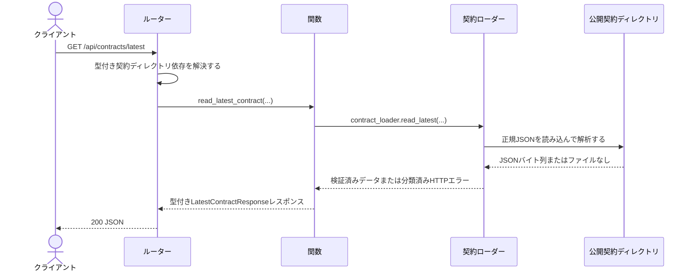

# getLatestContract シーケンス(自動生成)

```mermaid
sequenceDiagram
    actor Client as クライアント
    participant Router as ルーター
    participant Functions as 関数
    participant Loader as 契約ローダー
    participant Storage as 公開契約ディレクトリ
    Client->>Router: GET /api/contracts/latest
    Router->>Router: 型付き契約ディレクトリ依存を解決する
    Router->>Functions: read_latest_contract(...) 
    Functions->>Loader: contract_loader.read_latest(...) 
    Loader->>Storage: 正規JSONを読み込んで解析する
    Storage-->>Loader: JSONバイト列またはファイルなし
    Loader-->>Functions: 検証済みデータまたは分類済みHTTPエラー
    Functions-->>Router: 型付きLatestContractResponseレスポンス
    Router-->>Client: 200 JSON
```

## エラーシーケンス

- 契約ローダーは成果物の欠落を404へ分類する。
- 保存済みJSONの不正またはパス・データ不変条件の違反を500へ分類する。
- フレームワークによるパス検証の失敗は、該当する場合に422へ分類する。
- ルーターは広範な例外を捕捉せず、分類済みエラーをFastAPI経由で伝播する。
