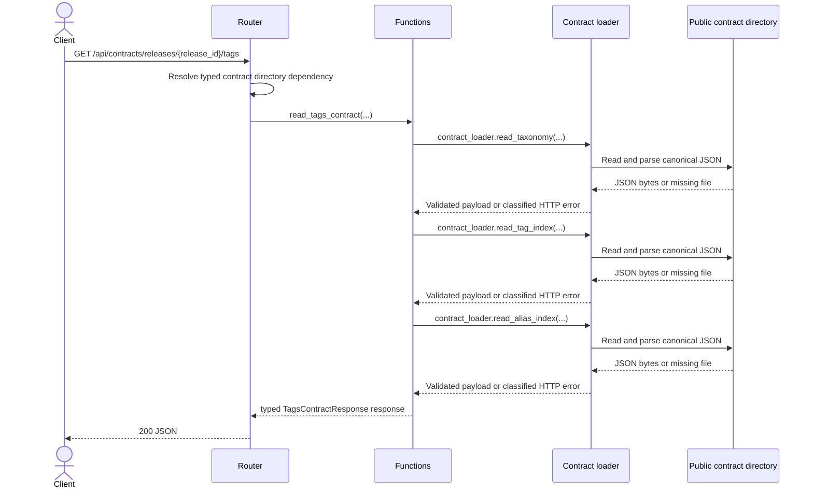

# getReleaseTagsContract sequence (generated)

## Error sequence

- Missing artifact is classified as 404 by the contract loader.
- Invalid stored JSON or a path/payload invariant failure is classified as 500.
- Framework path validation is classified as 422 where applicable.
- The router catches no broad exception; classified errors propagate through FastAPI.
