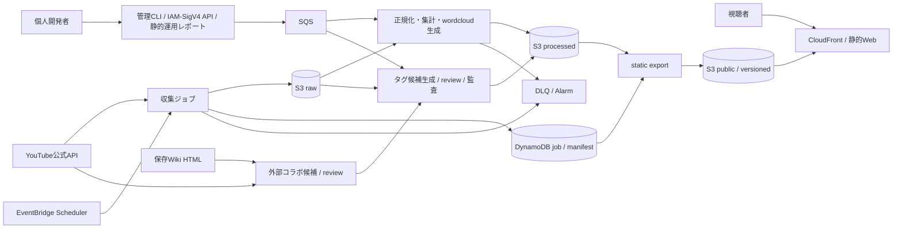

# diopside 統合要件定義書

- 文書ID: DIO-RD-001
- 版: 1.3.0
- 状態: documentation baseline complete / product acceptance pending
- 作成日: 2026-07-10
- 更新日: 2026-07-11
- 対象リリース: 本文の全スコープを含む単一リリース（フェーズ分割しない）
- 開発体制: 個人開発者1名がCodexを開発支援に使用
- 要件層の正本: 本文書
- 文書体系・正本順位: `docs/spec/00.index.md`

本文書はtarget productの要求を定義し、現行実装の完成状態を表さない。現行リポジトリは`apps/web` frontendとdevelopment seedを実装しており、collector、processor、tagging pipeline、infrastructure、production static exportは未実装である。要求上の未確定事項は16節、レビュー上の残件は [21.requirements-review-log.md](21.requirements-review-log.md) で管理する。

## 1. 文書の目的

本文書は、白雪巴の公開YouTubeアーカイブを「探す・つかむ・見返す」ためのdiopsideについて、次の全領域を一つの検証可能な要求仕様として定義する。

1. モバイルファーストの公開Webフロントエンド
2. 配信・動画メタデータの自動収集
3. ライブチャットおよび動画コメントの自動収集
4. 収集データの正規化、集計、検索用成果物生成
5. wordcloudおよびタイムスタンプ候補の生成・表示
6. 根拠付き構造化tagの生成、正規化、検索、監査、移行
7. 字幕・保存コメントからの配信本文の言及検出と根拠付きreview
8. Wiki、共演者側チャンネル、group aliasからの外部コラボ発見・精査・統合
9. 個人1名で低コストに運用・保守できる管理、監視、復旧

要件は実装方法の一覧ではなく、利用者の目的、システムが備える能力、制約、品質水準、受け入れ方法を記録する。SWEBOK Guide V4.0a Software Requirements KAの「機能要件と非機能要件の区別」「要件の原子性・非曖昧性・検証可能性」「受け入れ条件ベースの仕様」「レビュー」「優先度」「トレーサビリティ」を適用する。

## 2. 要件記法と規範

### 2.1 用語

- 「しなければならない」は必須要件を示す。
- 「してもよい」は許容される選択肢を示す。
- 「対象外」は本リリースで実装・提供しない事項を示す。
- PriorityはMoSCoWを使用する。ただし本文書はフェーズ分割を行わず、MustとShouldを同一リリースの受け入れ対象とする。Couldはコスト上限内でのみ実施し、未実施でもリリースを妨げない。
- Confidenceは confirmed（根拠資料で確認済み）または inferred（実現可能性を保つために導出）とする。
- Verificationは要件を証明する受け入れ条件、試験、レビューを示す。
- 本文の数値閾値のうち根拠資料に値がないものは、個人開発・コスト最小という制約から導出したinferredな初期基準である。要件baseline確定時に個人開発者が承認し、未承認ならQ-008として変更管理する。

### 2.2 個別要件の品質基準

各要件は、単一の判断を表し、同じ用語を一貫して使用し、適合・不適合を判定できなければならない。「高速」「適切」「可能な限り」など測定不能な語だけで品質を表現してはならない。

個別表で省略した属性は次を継承する。個別行の値がdefaultより優先し、Source／Verificationの詳細は個別表と[24.traceability-matrix.md](24.traceability-matrix.md)を結合する。

| 属性    | Default／override                                                                                                |
| ------------ | ---------------------------------------------------------------------------------------------------------------- |
| 種別         | ID prefixに従いbusiness requirement／constraint／gate／functional／data／non-functional                          |
| Priority     | Must。個別行でShould／Couldを明示した場合だけoverride                                                            |
| Confidence   | confirmed。根拠資料にない数値、費用／容量／復旧threshold、実装方式の選択はinferred                               |
| Inferred IDs | GATE-003、GATE-005、DR-002、DR-003、NFR-PERF-001〜004、NFR-REL-001、NFR-REL-004、NFR-COST-001〜004、Q-003〜Q-008 |
| 出典       | 個別表の出典。family表の場合は`30`の個別定義と`24`の出典 mapping                                             |
| Verification | 個別表、`23`のAC本文、`24`のreverse trace                                                                        |

### 2.3 要件変更

要件変更はGit上の本文書への変更として行い、変更理由、影響する要件ID、受け入れ条件、想定コストをPull Requestまたは作業記録に残す。Must/Should要件の削除、月額上限超過、外部API利用方針の変更は、個人開発者が影響分析後に明示承認する。

### 2.4 変更履歴

| 版    | 日付       | 変更理由                                                                                          | 主な影響ID                                                                                                                                          | 証跡                                                       |
| ----- | ---------- | ------------------------------------------------------------------------------------------------- | --------------------------------------------------------------------------------------------------------------------------------------------------- | ---------------------------------------------------------- |
| 1.0.0 | 2026-07-11 | baseline candidateとして文書体系へ登録                                                            | 全体                                                                                                                                                | docs/spec/00.index.md                                      |
| 1.0.1 | 2026-07-11 | Fableレビュー1・2の指摘を反映                                                                     | FR-AN-002/007、DR-005、FR-FE-002/004/011、FR-CHAT-008、FR-OPS-007/008、GATE-005、AC-FE-01/02/07、AC-ING-05、AC-QUOTA-01                             | reviews/requirements-fable-review-01.md、02.md             |
| 1.0.2 | 2026-07-11 | Fableレビュー3の非blocking指摘を反映                                                              | FR-OPS-007/008、AC-QUOTA-01、DR-TAG-006、AC-TAG-01-19                                                                                               | reviews/requirements-fable-review-03.md                    |
| 1.1.0 | 2026-07-11 | tag archive、system specification、acceptance、trace、current implementation gapを統合            | FR-TAG、DR-TAG、NFR-TAG、FR-FE、DR、GATE、AC全体                                                                                                    | docs/spec/21.requirements-review-log.md                    |
| 1.2.0 | 2026-07-11 | 追加されたtag archiveの本文言及・外部コラボ発見・partial metadata要求を統合                       | BR-011、FR-TAG-016〜023、DR-TAG-013〜017、NFR-TAG-010〜012、AC-TAG-08〜09、Q-009                                                                    | docs/spec/31.tagging-source-traceability.md                |
| 1.3.0 | 2026-07-11 | 現行統合版のFable議論に基づき、初回targetの互換・運用・認証を最小化し、保持・gate・完了条件を確定 | GATE-001/002、FR-CHAT-008、FR-FE-002/004、DR-003/007/008、NFR-PERF-002、NFR-REL-004、NFR-SEC-003、NFR-A11Y-002、NFR-COST-003、NFR-MAINT-001、AC全体 | `.workspace/requirements-fable-deliberation-2026-07-11.md` |

## 3. 根拠資料

| 出典 ID        | 資料                                                                      | 使用目的                                                                                |
| ---------------- | ------------------------------------------------------------------------- | --------------------------------------------------------------------------------------- |
| SRC-INDEX        | `docs/spec/00.index.md`                                                   | 文書境界、正本順位、current／target区別                                                 |
| SRC-UC-REPO      | `docs/spec/10.use-cases-personas-value.md`                                | personas A〜F、UC-01〜12、価値、scope、原則                                             |
| SRC-UC-INPUT     | `.workspace/diopside_use_cases_personas_value (1).md`、`tags.zip`同名file | UC-01〜10の受領原典。repo版と意味差分0を確認済み                                        |
| SRC-TAG          | `docs/spec/30.tagging-requirements.md`                                    | tag分類、付与、normalization、公開、監査、migration                                     |
| SRC-TAG-EVIDENCE | `docs/spec/31.tagging-source-traceability.md`                             | `tags.zip`全21 filesのhash、本人・本文言及・外部コラボの観測値、既知gap                 |
| SRC-SWEBOK       | `.workspace/swebok-v4.pdf`（SWEBOK Guide V4.0a）                          | 要件分類、分析、仕様化、validation、management                                          |
| SRC-DESIGN       | `docs/design/design-system.md`                                            | UI token、component、accessibility、responsive仕様                                      |
| SRC-IMPL         | `README.md`、`apps/web/shared/public-data/index.ts`、screen contracts     | 現行frontend、current public contract、implementation gap                               |
| SRC-YT-META      | https://developers.google.com/youtube/v3/docs/videos/list                 | videos metadata、batch、part、error                                                     |
| SRC-YT-LIVE      | https://developers.google.com/youtube/v3/live/docs/liveChatMessages/list  | live chat paging、polling、終了error                                                    |
| SRC-YT-COMMENT   | https://developers.google.com/youtube/v3/guides/implementation/comments   | commentsと全reply取得                                                                   |
| SRC-YT-QUOTA     | https://developers.google.com/youtube/v3/determine_quota_cost             | current quota buckets／cost。2026-07-11確認                                             |
| SRC-YT-POLICY    | https://developers.google.com/youtube/terms/developer-policies            | privacy policy、30日refresh、派生data原則。2026-07-11確認                               |
| SRC-YT-DERIVED   | https://developers.google.com/youtube/terms/derived-metrics-policy        | accepted analytics use caseでのcontent tagging・derived metrics追加条項。2026-07-11確認 |
| SRC-AWS          | https://aws.amazon.com/lambda/pricing/                                    | 実行課金と見積入力。見積時に再確認                                                      |

`.workspace` の入力はclone／CIで存在を保証しない。永続要件はrepo内文書へ統合し、入力hashと差分だけをevidenceとして保持する。

## 4. プロダクトの目的と成功条件

### 4.1 業務要求

| ID     | 要求                                                                                                                                         | Priority | 出典                     | Verification                              |
| ------ | -------------------------------------------------------------------------------------------------------------------------------------------- | -------: | -------------------------- | ----------------------------------------- |
| BR-001 | 利用者が公開アーカイブをタイトル、語句、タグ、年月、動画長から発見できなければならない。                                                     |     Must | UC-01, UC-02               | AC-FE-01, AC-FE-02                        |
| BR-002 | 利用者が長時間配信の話題と反応の大きい時間帯を再生前に把握できなければならない。                                                             |     Must | UC-03, UC-04               | AC-FE-03                                  |
| BR-003 | 利用者がお気に入りと閲覧履歴からアーカイブへ再訪できなければならない。                                                                       |     Must | UC-05                      | AC-FE-04                                  |
| BR-004 | システムが公開動画、配信予定、ライブ状態、動画コメント、ライブチャットを自動収集し、適法なreplay chat入力を自動取込できなければならない。    |     Must | UC-07〜UC-09、ユーザー依頼 | AC-ING-01〜AC-ING-06                      |
| BR-005 | システムが収集結果から静的公開データ、wordcloud、タイムスタンプ候補を生成できなければならない。                                              |     Must | UC-03, UC-04, UC-09, UC-10 | AC-AN-01〜AC-AN-03、AC-EXP-01、AC-DATA-01 |
| BR-006 | 個人開発者1名が障害の検知、原因確認、再実行、復旧を行えなければならない。                                                                    |     Must | UC-06、ペルソナE           | AC-OPS-01〜AC-OPS-05、AC-NFR-03           |
| BR-007 | 低利用時に常時稼働サーバーの固定費を発生させず、月額予算内で運用できなければならない。                                                       |     Must | 個人開発、コスト最小       | AC-COST-01                                |
| BR-008 | YouTube API Services Terms and Developer Policiesへの適合を、分析成果物の公開より優先しなければならない。                                    |     Must | SRC-YT-POLICY              | AC-COMP-01〜AC-COMP-05、AC-TAG-06         |
| BR-009 | 利用者が同名異軸を混同せず、作品、人物、企画、文脈、本文言及、公開形式の構造化tagを組み合わせて動画を発見できなければならない。              |     Must | UC-02、SRC-TAG             | AC-TAG-03、AC-TAG-04、AC-TAG-08           |
| BR-010 | 運用者が全対象動画のtag assignmentと本文言及・外部発見ledgerを再生成し、理由、source、confidence、採否、移行差分を監査できなければならない。 |     Must | UC-11、UC-12、SRC-TAG      | AC-TAG-01、02、05、07、08、09             |
| BR-011 | 利用者が、白雪巴本人のチャンネルだけでなく、公開情報から実出演・共同制作を確認した外部チャンネル動画も同じ検索軸で発見できなければならない。 |     Must | SRC-TAG                    | AC-TAG-09、AC-FE-02                       |

### 4.2 成功指標

| ID      | 指標                   | 合格水準                                                                                                                                        | 測定方法                    |
| ------- | ---------------------- | ----------------------------------------------------------------------------------------------------------------------------------------------- | --------------------------- |
| KPI-001 | 目的動画到達時間       | 開発者以外1名以上が初回利用で異なる代表5タスクを各1回実行し、4タスク以上で、同意画面表示から候補選択、動画詳細、YouTube遷移を60秒以内に完了する | 375px幅のユーザビリティ試験 |
| KPI-002 | 検索正確性             | 管理者が定義した代表クエリ20件のうち16件以上で、各クエリの期待動画が検索結果上位10件に含まれる                                                  | 固定検索評価データ          |
| KPI-003 | 収集鮮度               | 通常時、動画メタデータは公開・変更検知から6時間以内、コメントは24時間以内に反映                                                                 | JobEventとgeneratedAtの差   |
| KPI-004 | ライブチャット欠落監視 | 正常収集でページトークン連続性違反が0件であり、違反fixtureを投入した場合は全件を検出する                                                        | 収集manifest検査            |
| KPI-005 | 公開データ整合性       | manifestが参照する成果物の欠落・schema不適合0件                                                                                                 | artifact検証コマンド        |
| KPI-006 | 復旧可能性             | DLQ検知から30分以内に原因を特定し、redrive開始から30分以内、検知から合計60分以内に重複なく復旧する                                              | 運用演習                    |
| KPI-007 | 運用費                 | AWS利用料の通常月目標500円以下、上限1,000円。超過予測時は自動停止または手動承認待ち                                                             | AWS Budgetsと月次見積       |
| KPI-008 | tag構造完全性          | 本人・外部のapproved videoId集合差、必須基数違反、重複、unknown tagId、public参照欠落が各0件                                                    | AC-TAG-01、03、09           |
| KPI-009 | tag意味品質            | 固定semantic fixture、本文言及・外部発見のhigh-risk差分、partial metadata fixtureでblocking誤分類・placeholder・実在しないsource参照が0件       | AC-TAG-07〜09               |

KPI-007は独自ドメイン費、税、Codex利用料、開発端末、データ移行時の一時費用を除く。実トラフィックにより上限維持が不可能な場合、可用性や更新頻度を下げる前に要求変更として承認する。

## 5. スコープ

### 5.1 対象

- 白雪巴本人の公開YouTube動画、公開配信予定、公開中ライブ
- 保存Wiki HTML、canonical共演者チャンネル、白雪巴を構成員に持つgroupの実メンバー側チャンネルから発見し、実出演・共同制作を精査済みの外部公開動画
- YouTube公式APIから取得可能な公開メタデータ、公開動画コメント・返信
- 収集開始後に公式APIから取得できたライブチャット
- operatorが適法な取得経路、権利・許諾証跡、保持期限を記録してS3 inboundへ配置したreplay chatファイルの自動取込
- 生データ、正規化データ、集計データ、公開用静的成果物
- 動画一覧、検索、保存、履歴、動画詳細
- 個人運用者向けIAM／SigV4認証の管理CLI／APIと静的運用レポート
- wordcloud、頻出語、チャット／コメント件数、タイムライン、タイムスタンプ候補
- 7大分類・30小分類のtag taxonomy、alias、group registry、stable tagId、根拠付きassignment
- 字幕・保存コメントからの本文言及候補、accepted/review decision、coverage、時刻付きprivate evidence
- Wiki、共演者名scan、group alias scanの候補・採否・除外理由・未解決channel・取得不能metadataを含む外部発見ledger
- v1タグ移行、構造／意味監査、タグ公開投影
- ジョブ実行、監視、再試行、DLQ、予算監視、バックアップ、削除
- 利用規約、プライバシーポリシー、データ削除窓口

### 5.2 対象外

- 非公開、限定公開または権限のないデータ
- YouTubeのアクセス制限、rate limit、API制約を回避するスクレイピング
- 終了済み配信のreplay chatを非公式endpoint、画面scraping、アクセス制限回避で自動取得する処理。適法なoperator-provided inputの取込は対象に含む
- 動画、音声、サムネイルの複製保存またはオフライン再生
- YouTubeへのコメント投稿、返信、評価、削除、モデレーション
- 完全自動の切り抜き動画生成
- 個々の視聴者の行動、属性、嗜好、センシティブ情報の推定
- 未承認語からのcanonical tag自動新設、tag根拠comment本文・投稿者識別子の公開
- 常時稼働のEC2/ECS/RDB/OpenSearch
- 広告配信、課金、一般利用者のアカウント登録
- 管理用Web UI、cookie session、一般利用者向け管理navigation
- 検索エンジン向けcontent露出と、未同意状態の動画preview

## 6. ステークホルダーとペルソナ

| ID    | ステークホルダー                          | 主なニーズ                                                  | 関連UC                     |
| ----- | ----------------------------------------- | ----------------------------------------------------------- | -------------------------- |
| ST-01 | 初見・ライト視聴者                        | 1分以内に興味のある動画を見つける                           | UC-01, UC-02, UC-04        |
| ST-02 | 常連ファン                                | 断片的な語や時期から再発見し、保存・再訪する                | UC-01, UC-02, UC-03, UC-05 |
| ST-03 | 切り抜き・まとめ作成者                    | 人が確認すべき話題・時間帯の候補を絞る                      | UC-03, UC-04               |
| ST-04 | 分析志向のファン                          | 年、タグ、話題、反応を横断して俯瞰する                      | UC-02, UC-04               |
| ST-05 | 個人開発者兼運用者                        | 低コストで収集・生成・公開し、失敗を復旧する                | UC-06〜UC-10               |
| ST-06 | YouTube、投稿者、コメント・チャット投稿者 | 規約、権利、データ鮮度、削除、プライバシーを守られる        | 全UC                       |
| ST-07 | タグキュレーター・監査者                  | 分類理由、source、semantic差分を確認し未確定tagを公開しない | UC-11、UC-12               |

## 7. 前提、制約、承認ゲート

### 7.1 確定制約

| ID      | 制約                                                                                                                                                                                                  | Confidence | Verification           |
| ------- | ----------------------------------------------------------------------------------------------------------------------------------------------------------------------------------------------------- | ---------- | ---------------------- |
| CON-001 | 開発・保守の人的主体は1名とし、Codexは設計、実装、テスト、文書化の支援に使用する。最終判断と外部サービス操作は人が担う。                                                                              | confirmed  | AC-DEV-01、AC-GOV-01   |
| CON-002 | 継続的なmetadata/chat/comment収集の初期対象は白雪巴本人の1チャンネルとする。外部コラボはWikiと解決済み共演者・group member側uploadsを発見経路とし、精査採用したvideoId単位でmetadataとtagを管理する。 | confirmed  | AC-ING-01、AC-TAG-09   |
| CON-003 | 公開フロントは静的生成物をCDN配信し、閲覧ごとの動的API呼び出しを必須にしない。                                                                                                                        | confirmed  | AC-FE-05               |
| CON-004 | 収集・生成はイベント駆動または短時間バッチとし、常時稼働コンピュートを使用しない。                                                                                                                    | confirmed  | AC-COST-01             |
| CON-005 | YouTube APIキー、管理認証情報、署名鍵をクライアント成果物やログへ含めない。                                                                                                                           | confirmed  | AC-SEC-01              |
| CON-006 | 公式APIの初回ライブチャット取得は直近履歴に限られ、終了後はliveChatEndedとなるため、ライブ中に収集を開始・継続する。                                                                                  | confirmed  | AC-ING-03、AC-QUOTA-01 |
| CON-007 | 非認可API Dataは30日以内に削除または再取得して鮮度確認する。削除済み・非公開化されたデータを公開し続けない。                                                                                          | confirmed  | AC-COMP-02、AC-DATA-02 |
| CON-008 | tagの内部正本を平坦な表示名配列にせず、category、subcategory、stable tagIdを保持する。                                                                                                                | confirmed  | AC-TAG-01、03          |
| CON-009 | tag assignmentのreason、source、evidenceはaudit領域に保持し、public projectionへ既定で含めない。                                                                                                      | confirmed  | AC-TAG-03              |
| CON-010 | 現行repo実装はfrontendだけであり、target pipeline要件を実装済みと記録してはならない。                                                                                                                 | confirmed  | AC-DEV-02              |

### 7.2 Go/No-Goゲート

| ID       | ゲート                         | 合格条件                                                                                                                                                                                                                                                                                                                                                                                                      | 不合格時の挙動                                                                                                                                                                                                                                                                                                                                                                                                               |
| -------- | ------------------------------ | ------------------------------------------------------------------------------------------------------------------------------------------------------------------------------------------------------------------------------------------------------------------------------------------------------------------------------------------------------------------------------------------------------------- | ---------------------------------------------------------------------------------------------------------------------------------------------------------------------------------------------------------------------------------------------------------------------------------------------------------------------------------------------------------------------------------------------------------------------------- |
| GATE-001 | YouTube派生データ承認          | SRC-YT-DERIVEDの追加条項を受諾し、content categorization/tagging、comment分析、wordcloud、timestamp候補、必要な保存期間を含むanalytics use caseが対象API projectについて受理され、証跡のscope・期限がproduction構成と一致する                                                                                                                                                                                 | 初回production normal releaseを拒否する。metadata-only表示状態はrelease modeではなく、stagingではnormal相当buildの検証構成、受入済みnormal release後の失効時は`compliance_purge`で実現し、初回target acceptanceに数えない。Non-Authorized Dataは30日refresh/deleteを継続し、禁止データを減らす`compliance_purge`は実行するが通常releaseの合格とは扱わない。BR-002、BR-005、BR-009、BR-010は未達のためproduct DoDを満たさない |
| GATE-002 | 対象チャンネル・コンテンツ利用 | version付き利用判定台帳に、source区分、対象集合、表示方法、sourceKind、partial metadata表示、問い合わせ先、適用規約・法令上の利用根拠、追加許諾要否を記録する。公式公開metadata／YouTube linkは台帳の規約ベース判定、Wiki等の出演事実は精査手続き・diopside生成表示・削除窓口、operator-provided replay等はDR-008の証跡で判定し、追加許諾が必要なsourceだけ有効な証跡を必須とする。判断不能なsourceは除外する | 台帳未作成、判断不能source混入、または必要と判定した証跡の欠落時は、該当sourceを本番収集・公開しない                                                                                                                                                                                                                                                                                                                         |
| GATE-003 | 月額見積                       | 通常負荷、配信ピーク、データ保存量を入力した見積が月額上限1,000円以下                                                                                                                                                                                                                                                                                                                                         | 更新頻度、保持量、公開成果物サイズを見直し、承認までdeployしない                                                                                                                                                                                                                                                                                                                                                             |
| GATE-004 | プライバシー表示・同意         | 利用規約、プライバシーポリシー、YouTube利用とGoogle Privacy Policyへのリンク、削除窓口、FR-FE-011の同意導線が公開されている                                                                                                                                                                                                                                                                                   | 一般公開しない                                                                                                                                                                                                                                                                                                                                                                                                               |
| GATE-005 | YouTube quota成立性            | 15.4のlow、standard、peakについてmethod別・日別のquota消費、進行中live用予約量、実quota上限を計算し、standardと停止制御後peakが上限内に収まる。収まらない場合は承認済みquota増加がある                                                                                                                                                                                                                        | quota増加承認または要件変更まで本番収集を開始しない                                                                                                                                                                                                                                                                                                                                                                          |
| GATE-006 | tag release品質                | AC-TAG-01〜09が合格し、semantic blocking defect、review state、unknown tagId、partial metadata placeholder、実在しないsource参照がproduction集合に0件である                                                                                                                                                                                                                                                   | tagを含むreleaseを公開せず、直前正常releaseを維持する                                                                                                                                                                                                                                                                                                                                                                        |

Gateごとのexact verificationは次を正とする。

| Gate reference | 受け入れ            |
| -------------- | --------------------- |
| `GATE-001`     | AC-COMP-04、AC-TAG-06 |
| `GATE-002`     | AC-COMP-01            |
| `GATE-003`     | AC-COST-01            |
| `GATE-004`     | AC-FE-06、AC-COMP-01  |
| `GATE-005`     | AC-QUOTA-01           |
| `GATE-006`     | AC-TAG-01〜AC-TAG-09  |

GATE-001は機能を縮小して完了扱いにするための逃げ道ではない。承認が得られない限り、wordcloudを含む依頼全体はblockedである。GATE-001〜006待ちでも、実装と固定fixture検証が完了した状態を`release candidate`と記録できるが、product DoD、production acceptance、公開完了とは呼ばない。

## 8. システムコンテキストと責務

責務境界:

- 公開フロントは公開済み静的データの検索・表示だけを担う。
- 収集基盤は外部APIとの通信、チェックポイント、quota記録を担う。
- 処理基盤は正規化、匿名化、集計、生成を担う。
- tag基盤はtaxonomy、alias、registryをversion固定し、根拠付きassignment、review、semantic auditを担う。
- 外部発見基盤はWiki台帳、共演者・group member側uploads scan、候補採否、未解決・取得不能ledgerを担い、未確定候補を公開集合から分離する。
- 公開基盤は検証済み成果物だけを原子的に切り替える。
- 管理経路は認証済み運用者だけにジョブ起動・停止・再実行・状態確認を許可する。

## 9. 機能要件

### 9.1 動画・配信メタデータ収集

| ID          | 要件                                                                                                                                                                                                                                                                                                                                                                                                                                      | Priority | 出典                   | Verification           |
| ----------- | ----------------------------------------------------------------------------------------------------------------------------------------------------------------------------------------------------------------------------------------------------------------------------------------------------------------------------------------------------------------------------------------------------------------------------------------- | -------: | ------------------------ | ---------------------- |
| FR-META-001 | システムはchannels.listでuploads playlistを特定し、playlistItems.listから動画IDを差分取得しなければならない。通常巡回を専用日次枠のあるsearch.listへ依存させてはならない。                                                                                                                                                                                                                                                                |     Must | UC-07, SRC-YT-QUOTA      | AC-ING-01              |
| FR-META-002 | システムはvideos.listを50動画ID以下でバッチし、snippet、contentDetails、statistics、status、liveStreamingDetailsの必要項目だけを取得しなければならない。                                                                                                                                                                                                                                                                                  |     Must | UC-07                    | AC-ING-01              |
| FR-META-003 | 動画ごとにvideoId、channelId、title、description、publishedAt、scheduledStartTime、actualStartTime、actualEndTime、duration、liveBroadcastContent、privacyStatus、embeddable、thumbnail参照、sourceTags、youtubeCategoryId、viewCount、likeCount、commentCount、etag、fetchedAtを保持しなければならない。APIが返さない値はnullまたは欠落として扱い、0で代用してはならない。`sourceTags`とdiopsideの`tagAssignments`を混同してはならない。 |     Must | UC-07, SRC-IMPL、SRC-TAG | AC-ING-01、schema test |
| FR-META-004 | システムはupcoming、live、archive、unavailableの状態遷移を記録し、ライブ開始候補を通常5分間隔、その他を6時間間隔以内で再確認しなければならない。                                                                                                                                                                                                                                                                                          |     Must | UC-07, UC-08             | AC-ING-02              |
| FR-META-005 | システムは非公開化、削除、取得不能を検知し、次回公開manifestから当該動画と派生成果物を除外しなければならない。                                                                                                                                                                                                                                                                                                                            |     Must | SRC-YT-POLICY            | AC-COMP-02             |
| FR-META-006 | 同一etagまたは同一取得結果の再処理は新しい成果物版を生成せず、quota、要求回数、最終確認時刻だけを更新しなければならない。                                                                                                                                                                                                                                                                                                                 |   Should | コスト最小               | AC-ING-01              |

### 9.2 ライブチャット収集

| ID          | 要件                                                                                                                                                                                                                                                                           | Priority | 出典               | Verification |
| ----------- | ------------------------------------------------------------------------------------------------------------------------------------------------------------------------------------------------------------------------------------------------------------------------------ | -------: | -------------------- | ------------ |
| FR-CHAT-001 | activeLiveChatIdを検知したシステムは、ライブ中に公式streamListを開始し、利用不能または未対応の場合はliveChatMessages.listへfallbackしなければならない。                                                                                                                        |     Must | UC-08, SRC-YT-LIVE   | AC-ING-03    |
| FR-CHAT-002 | list使用時はレスポンスのpollingIntervalMillisより短い間隔で再要求せず、nextPageTokenを永続化しなければならない。                                                                                                                                                               |     Must | SRC-YT-LIVE          | AC-ING-03    |
| FR-CHAT-003 | Lambdaの1回の制限時間内に完了しない配信では、videoId、liveChatId、nextPageToken、lastPublishedAt、lastMessageIdをチェックポイントして後続実行へ引き継がなければならない。                                                                                                      |     Must | 個人運用、実現可能性 | AC-ING-03    |
| FR-CHAT-004 | 収集はmessageIdで冪等に保存し、再試行やページ重複で同一メッセージを二重計上してはならない。giftEvent等の更新型IDはupdatedAtと内容ハッシュを用いて上書きしなければならない。                                                                                                    |     Must | SRC-YT-LIVE          | AC-ING-03    |
| FR-CHAT-005 | textMessage、Super Chat、Super Sticker、member milestone、membership gifting、poll、削除tombstone、ban、chat ended、未知種別を識別可能な共通schemaへ写像しなければならない。未知種別でジョブ全体を失敗させず、raw参照付きunknownとして隔離しなければならない。                 |     Must | UC-09                | AC-ING-03    |
| FR-CHAT-006 | liveChatEnded、liveChatDisabled、forbidden、notFoundを区別して終了状態を保存し、再試行不能エラーを無限再試行してはならない。                                                                                                                                                   |     Must | SRC-YT-LIVE          | AC-ING-03    |
| FR-CHAT-007 | システムは「収集開始以前のメッセージを完全取得した」と表示してはならず、coverageStart、coverageEnd、completeFromStartを成果物へ含めなければならない。                                                                                                                          |     Must | SRC-YT-LIVE          | AC-COMP-03   |
| FR-CHAT-008 | システムはS3 inboundへ配置されたreplay chat JSONLを、videoId、source、取得日時、取得方法、権利・許諾証跡、保持期限、content hashを持つimport manifestとともに自動取込できなければならない。証跡欠落、schema不正、重複hash、対象外videoの入力は隔離し、分析へ渡してはならない。 |     Must | UC-08、SRC-UC-INPUT  | AC-ING-05    |

### 9.3 動画コメント・返信収集

| ID         | 要件                                                                                                                                                                                                                                                                    | Priority | 出典                       | Verification |
| ---------- | ----------------------------------------------------------------------------------------------------------------------------------------------------------------------------------------------------------------------------------------------------------------------- | -------: | ---------------------------- | ------------ |
| FR-COM-001 | システムは公開動画ごとにcommentThreads.listをページ終端まで取得し、top-level commentを保存しなければならない。                                                                                                                                                          |     Must | ユーザー依頼, SRC-YT-COMMENT | AC-ING-04    |
| FR-COM-002 | commentThreadに含まれる返信数と取得済み返信数が異なる場合、comments.listをページ終端まで実行して全返信を取得しなければならない。                                                                                                                                        |     Must | SRC-YT-COMMENT               | AC-ING-04    |
| FR-COM-003 | コメントはcommentId、parentId、videoId、textOriginal、authorChannelId、authorDisplayName、publishedAt、updatedAt、likeCount、visibilityState=public_at_fetch、fetchedAtをraw private領域に保存しなければならない。公開APIが返さないmoderation状態を推定してはならない。 |     Must | SRC-YT-COMMENT               | AC-ING-04    |
| FR-COM-004 | 初回は全ページを取得し、以後は少なくとも12時間ごとに新着側のページを走査しなければならない。過去コメントの編集・削除を反映するため、差分走査だけに依存せず、全保存データを30日以内に全ページ再確認しなければならない。                                                  |     Must | SRC-YT-POLICY                | AC-COMP-02   |
| FR-COM-005 | commentsDisabled、videoNotFound、forbidden、quotaExceeded、一時的5xxを区別し、無効・恒久エラーは状態として終了し、一時エラーだけを上限付きで再試行しなければならない。                                                                                                  |     Must | 運用品質                     | AC-ING-06    |
| FR-COM-006 | 削除または非公開化されたコメントと返信を次回公開成果物から除外し、private保存も規約・削除要求に従って削除しなければならない。                                                                                                                                           |     Must | SRC-YT-POLICY                | AC-COMP-02   |

### 9.4 正規化、集計、分析

| ID        | 要件                                                                                                                                                                                                                                                                                                                                       | Priority | 出典                 | Verification |
| --------- | ------------------------------------------------------------------------------------------------------------------------------------------------------------------------------------------------------------------------------------------------------------------------------------------------------------------------------------------ | -------: | ---------------------- | ------------ |
| FR-AN-001 | システムは規約上の保持期間内でrawレスポンスを不変保存した後、sourceType、sourceId、videoId、eventAt、relativeSec、text、eventType、paidKind、amountMicros、currency、authorDedupToken、schemaVersionを持つ正規化レコードへ変換しなければならない。削除・失効要件は不変性より優先する。                                                     |     Must | UC-09                  | AC-AN-01     |
| FR-AN-002 | public成果物はauthorChannelId、authorDisplayName、プロフィール画像、個別メッセージ本文、個別支払額、authorDedupTokenを含めてはならない。uniqueAuthorsApproxは、videoごとの秘密鍵でauthorChannelIdをHMAC-SHA-256したprivateなauthorDedupTokenから算出する。tokenはvideoをまたいで一致せず、個人追跡に使用してはならない。                   |     Must | ST-06, privacy         | AC-SEC-02    |
| FR-AN-003 | 日本語テキスト処理はUnicode正規化、URL除去、制御文字除去、改行正規化、言語別tokenize、stopword、最小文字数、絵文字の扱いをversion付き設定として再現可能にしなければならない。                                                                                                                                                              |     Must | UC-04                  | AC-AN-01     |
| FR-AN-004 | チャットとコメントを別集計として保持し、混合集計を表示する場合は内訳と対象期間を明示しなければならない。                                                                                                                                                                                                                                   |     Must | ユーザー依頼           | AC-AN-01     |
| FR-AN-005 | GATE-001合格後、動画別chat／comment集計はtotalCount、uniqueAuthorsApprox、topTerms、coverage（sourceUpdatedAtを内包）、generatedAt、algorithmVersionを持つ。chatだけがpaidEventCountと動画内relative-second timeline、commentsはUTC wall-clock timelineを持ち、paid fieldを持たない。値が取得不能・非適用なら欠落とし0埋めしてはならない。 |     Must | UC-03, SRC-IMPL        | AC-AN-01     |
| FR-AN-006 | GATE-001合格後、タイムスタンプ候補は概要欄時刻、チャット量スパイク、語句スパイクの根拠種別、時刻、ラベル、信頼度、対象coverageを持ち、人の確定結果と誤認させてはならない。                                                                                                                                                                 |     Must | UC-03                  | AC-AN-03     |
| FR-AN-007 | 削除・失効が未適用の同一processed manifest、authorDedupToken、algorithmVersionの再実行は同一論理結果を生成し、成果物hashで検証できなければならない。DR-005またはDR-007の削除後は削除が再現性より優先し、旧成果物を無効化して再計算対象にしてはならない。                                                                                   |     Must | 再現性、DR-005、DR-007 | AC-AN-01     |

### 9.5 wordcloud生成

| ID        | 要件                                                                                                                                                                                                                                                                                               | Priority | 出典                    | Verification |
| --------- | -------------------------------------------------------------------------------------------------------------------------------------------------------------------------------------------------------------------------------------------------------------------------------------------------- | -------: | ------------------------- | ------------ |
| FR-WC-001 | GATE-001合格後、システムは動画ごとにチャット、コメント、両方の選択可能な語頻度からwordcloudを自動生成しなければならない。                                                                                                                                                                          |     Must | UC-04, BR-005             | AC-AN-02     |
| FR-WC-002 | wordcloudはSVGを正とする。metadata JSONは常にvideoId、sourceSet、status、coverage、tokenizerVersion、stopwordVersion、algorithmVersion、generatedAtを持つ。`status=generated`はtopTerms、svgPath、svgSha256を必須とし、`status=not_generated`はnotGeneratedReasonを必須としてSVG fieldを禁止する。 |     Must | UC-04, SRC-IMPL           | AC-AN-02     |
| FR-WC-003 | SVGはスクリプト、外部参照、イベントハンドラーを含まない安全な静的画像とし、語の大きさは頻度に単調増加しなければならない。                                                                                                                                                                          |     Must | security, usability       | AC-AN-02     |
| FR-WC-004 | 解析対象語が設定下限未満の場合は画像を捏造せずnotGeneratedReason=insufficient_termsを出力し、UIは空状態を表示しなければならない。                                                                                                                                                                  |     Must | 品質                      | AC-AN-02     |
| FR-WC-005 | NG語、個人情報らしいtoken、URL、連続数字、単一投稿者だけが発した低頻度語を除外でき、除外設定の変更履歴を残さなければならない。                                                                                                                                                                     |     Must | privacy, abuse prevention | AC-AN-02     |

### 9.6 静的公開データ生成

| ID         | 要件                                                                                                                                                                                                                                                                                                                 | Priority | 出典                 | Verification          |
| ---------- | -------------------------------------------------------------------------------------------------------------------------------------------------------------------------------------------------------------------------------------------------------------------------------------------------------------------- | -------: | ---------------------- | --------------------- |
| FR-EXP-001 | システムはindex、tag index、search index、動画詳細、wordcloud、timestamp候補をversioned pathへ生成し、全検証成功後にlatest manifestを最後に切り替えなければならない。GATE無効化・削除・失効時は、禁止データを追加せず削除するだけの`compliance_purge` releaseを通常releaseと分離して生成・切り替えなければならない。 |     Must | UC-10、DR-001          | AC-EXP-01、AC-DATA-01 |
| FR-EXP-002 | canonical公開JSONは共通に`schemaVersion`、`releaseId`、`releaseMode`、`generatedAt`を持ち、source video／coverageを含むrecordは`sourceUpdatedAt`も持たなければならない。後方互換でない変更はmajor schemaVersionと別pathを使用する。                                                                                  |     Must | 保守性                 | AC-DATA-01            |
| FR-EXP-003 | export前にJSON schema、参照整合性、重複ID、日付、負数、成果物hash、SVG安全性、private field混入を検査し、1件でも失敗した版を公開してはならない。                                                                                                                                                                     |     Must | 品質、security         | AC-EXP-01             |
| FR-EXP-004 | 直前の正常版を最低2版保持し、manifestを切り戻すだけで15分以内に復旧できなければならない。                                                                                                                                                                                                                            |     Must | UC-06                  | AC-OPS-02             |
| FR-EXP-005 | CDN cacheはversioned artifactをpointerより長く最大300秒、latest manifestを最大60秒cacheとし、不整合時間を5分以内に抑えなければならない。source削除、30日refresh失敗、Policy失効時はimmutable設定よりpurge／アクセス停止を優先する。                                                                                  |   Should | コスト、整合性、DR-001 | AC-DATA-01、AC-EXP-01 |

### 9.7 公開フロントエンド

| ID        | 要件                                                                                                                                                                                                                                                                                                                                                                                                                  | Priority | 出典                      | Verification       |
| --------- | --------------------------------------------------------------------------------------------------------------------------------------------------------------------------------------------------------------------------------------------------------------------------------------------------------------------------------------------------------------------------------------------------------------------- | -------: | --------------------------- | ------------------ |
| FR-FE-001 | ホームは最新動画、クイックタグ、ランダム発見を表示し、動画詳細とYouTube再生へ遷移できなければならない。                                                                                                                                                                                                                                                                                                               |     Must | UC-01                       | AC-FE-01           |
| FR-FE-002 | 検索は語句、タグ、投稿日範囲、動画長、成果物有無を組み合わせ、newest、oldest、longestで並べ替えられなければならない。GATE-001合格後はmostChatも提供する。GATE-001が有効でないstaging検証または失効時containment releaseでは、mostChat、tag facet／suggest／condition／query、artifact conditionをDOMとURLから除外しなければならない。                                                                                 |     Must | UC-02, SRC-DESIGN、GATE-001 | AC-FE-02、AC-FE-07 |
| FR-FE-003 | 検索条件はURL queryに反映して共有でき、0件時は解除可能な条件を1件以上提示しなければならない。                                                                                                                                                                                                                                                                                                                         |     Must | SRC-DESIGN                  | AC-FE-02           |
| FR-FE-004 | 動画詳細はメタデータとYouTube導線を表示しなければならない。GATE-001合格後はtag、チャット集計、コメント集計、wordcloud、タイムライン、タイムスタンプ候補、coverage、生成時刻を存在する項目だけ表示する。GATE-001が有効でないstaging検証または失効時containment releaseでは、tagと全派生セクション／参照を非表示にしなければならない。                                                                                  |     Must | UC-03, UC-04、GATE-001      | AC-FE-03、AC-FE-07 |
| FR-FE-005 | お気に入り、履歴、最近の検索をlocalStorageへ保存し、利用者が個別削除と全削除を行えなければならない。                                                                                                                                                                                                                                                                                                                  |     Must | UC-05                       | AC-FE-04           |
| FR-FE-006 | indexまたは詳細成果物の取得失敗時は、既存画面を破壊せず、再試行操作とYouTube直接導線を表示しなければならない。                                                                                                                                                                                                                                                                                                        |     Must | error path                  | AC-FE-10           |
| FR-FE-007 | 375px以上767px以下では単一カラムと下部4タブ、768px以上では220pxサイドバーを使用し、コンテンツを横スクロールさせてはならない。                                                                                                                                                                                                                                                                                         |     Must | SRC-DESIGN                  | AC-NFR-02          |
| FR-FE-008 | チップ、ボタン、リンク等の操作対象は44px四方以上、本文コントラスト4.5:1以上、キーボード操作、可視focus、Esc、focus trap、prefers-reduced-motionへ対応しなければならない。                                                                                                                                                                                                                                             |     Must | SRC-DESIGN                  | AC-NFR-02          |
| FR-FE-009 | wordcloudは代替テキストとして上位語と対象source／期間を提供し、色や文字サイズだけに意味を依存してはならない。                                                                                                                                                                                                                                                                                                         |     Must | accessibility               | AC-NFR-02          |
| FR-FE-010 | フロントはYouTube APIを直接呼ばず、公開静的成果物だけで主要閲覧機能を提供しなければならない。                                                                                                                                                                                                                                                                                                                         |     Must | CON-003                     | AC-FE-05           |
| FR-FE-011 | 初回利用時とプライバシーポリシーのmajor改定後は、最前面の同意画面でYouTube Terms、Google Privacy Policy、diopside利用規約・プライバシーポリシーを提示しなければならない。同意前は動画一覧、title、thumbnail、metadata、検索、分析を含む全YouTube API Data由来表示を遮断し、policy／問い合わせ先と固定設定のYouTube channel直リンクだけを提供する。同意versionはlocalStorageだけに保存し、拒否者を追跡してはならない。 |     Must | SRC-YT-POLICY               | AC-FE-06           |

### 9.8 管理、ジョブ、復旧

| ID         | 要件                                                                                                                                                                                                                                                                                                                                                                                                                                                                                          | Priority | 出典               | Verification            |
| ---------- | --------------------------------------------------------------------------------------------------------------------------------------------------------------------------------------------------------------------------------------------------------------------------------------------------------------------------------------------------------------------------------------------------------------------------------------------------------------------------------------------- | -------: | -------------------- | ----------------------- |
| FR-OPS-001 | 管理者はmetadata_sync、live_chat_collect、replay_chat_import、comment_collect、normalize、aggregate、wordcloud、static_exportを動画単位または差分単位で起動できなければならない。                                                                                                                                                                                                                                                                                                             |     Must | UC-06〜UC-10         | AC-OPS-01               |
| FR-OPS-002 | ジョブ起動はjobType、targetId、inputVersionからidempotency keyを生成し、同一実行中ジョブの重複起動を拒否しなければならない。                                                                                                                                                                                                                                                                                                                                                                  |     Must | UC-06                | AC-OPS-01、AC-OPS-05    |
| FR-OPS-003 | 各JobEventはjobId、parentJobId、type、target、status、attempt、queuedAt、input manifest、correlationId、method別YouTube API quota unitsを記録し、startedAt、endedAt、output manifest、errorCode、retry／DLQ fieldはstatusに応じて必須または禁止しなければならない。                                                                                                                                                                                                                           |     Must | ペルソナE            | AC-OPS-01               |
| FR-OPS-004 | 一時エラーは指数backoff+jitterで最大3回再試行し、恒久エラーまたは上限超過をDLQへ送らなければならない。                                                                                                                                                                                                                                                                                                                                                                                        |     Must | 運用品質             | AC-OPS-02               |
| FR-OPS-005 | 管理者はDLQメッセージの原因、入力、attempt、関連ログを確認し、修正後に同じidempotency keyの履歴を保ってredriveできなければならない。                                                                                                                                                                                                                                                                                                                                                          |     Must | UC-06                | AC-OPS-02               |
| FR-OPS-006 | 管理者は日次quota使用量、AWS推定費、保存量、ジョブ成功率、最終正常export時刻、DLQ件数を1画面または1レポートで確認できなければならない。                                                                                                                                                                                                                                                                                                                                                       |     Must | ペルソナE            | AC-OPS-03               |
| FR-OPS-007 | 予測quota 80%、AWS月額目標80%、DLQ 1件、export鮮度24時間超過で通知しなければならない。quota 95%時はYouTube API要求を伴うjobだけを対象とし、30日compliance期限まで7日以上あるコメント全件再走査、12時間ごとの新着コメント差分走査、期限まで7日以上ある6時間間隔metadata再確認の順に停止する。削除反映、期限まで7日未満のcompliance再確認、FR-META-004の5分間隔ライブ開始候補確認、進行中live chatは継続する。AWS月額上限予測時はNFR-COST-004の順序で過去分析再生成を含む低優先処理を停止する。 |     Must | コスト最小、GATE-005 | AC-COST-01、AC-QUOTA-01 |
| FR-OPS-008 | chat collector開始前に進行中live chat用quotaを予約しなければならない。予約量は、運用者が予定配信時間を設定している場合はその残り時間と8時間の大きい方、未設定の場合は8時間と、pollingIntervalの保守値から算出する。YouTube API値から予定終了時刻を推定してはならない。予約後にGATE-005上限を超える場合、低優先jobを開始せず運用者へ通知する。                                                                                                                                                 |     Must | CON-006、GATE-005    | AC-QUOTA-01             |

### 9.9 タグ分類・正規化・公開

FR-TAG-001〜023のnormative definition、Priority、Confidence、Source、Verificationは [30.tagging-requirements.md section 8](30.tagging-requirements.md#8-機能要件) を正とする。本文書はfamilyを統合要件として参照するが、同じIDを再定義しない。

| 分類 | 件数 | 範囲                                                                                                                               | 仕様                                       | 受け入れ    |
| ------ | ----: | ----------------------------------------------------------------------------------------------------------------------------------- | ---------------------------------------------------- | ------------- |
| FR-TAG |    23 | population、taxonomy、assignment、normalization、本文言及、外部コラボ発見・精査、review、reproducibility、search、migration、Policy | SPEC-DATA-TAG-001、SPEC-UI-TAG-001、SPEC-OPS-TAG-001 | AC-TAG-01〜09 |

## 10. データ要件

### 10.1 データ層

| 層        | 正本                             | 内容                                                                                                                 | 公開範囲 |
| --------- | -------------------------------- | -------------------------------------------------------------------------------------------------------------------- | -------- |
| raw       | S3、gzip JSONL/JSON              | 公式APIレスポンス、取得時刻、request metadata                                                                        | private  |
| control   | DynamoDB                         | Video状態、Job、JobEvent、manifest、checkpoint、quota、tag registry／review state                                    | private  |
| processed | S3、Parquetまたはgzip JSONL/JSON | 正規化レコード、匿名化済み中間集計、reason／evidence付きtag assignment、本文言及・外部発見ledger                     | private  |
| public    | S3、JSON/SVG                     | sourceKind／metadataStatus付きindex、tag taxonomy／index／alias、video detail、wordcloud、timestamp、latest manifest | public   |

### 10.2 データ保持と削除

| ID     | 要件                                                                                                                                                                                                                                                                                                                                                           | Verification          |
| ------ | -------------------------------------------------------------------------------------------------------------------------------------------------------------------------------------------------------------------------------------------------------------------------------------------------------------------------------------------------------------- | --------------------- |
| DR-001 | API Dataは取得日から30日以内に再取得して現在性を検証し、再取得不能、削除、非公開、許諾撤回ならpublic、processed、rawの順に関連データを削除する。                                                                                                                                                                                                               | AC-COMP-02            |
| DR-002 | job、quota、費用、エラーなどYouTubeユーザーデータを含まない運用記録は400日保持し、その後削除する。                                                                                                                                                                                                                                                             | AC-DATA-02            |
| DR-003 | S3 versioningをpublicと設定に有効化し、raw/processedの不要旧版は30日、公開旧版は最大90日で期限切れにする。公開旧版は現行source dataの現在性検証を共有し、再取得不能、source削除、非公開化、Policy失効時は旧版を再生成せず、該当versioned URLとCDN cacheを期限前に削除またはアクセス不能にする。                                                                | AC-DATA-02            |
| DR-004 | raw/processed/controlはSSEを有効化し、public bucketへの書込み主体をexport roleだけに制限する。                                                                                                                                                                                                                                                                 | AC-DATA-02、AC-SEC-01 |
| DR-005 | authorChannelIdのpublic出力を禁止し、privateでも正規化完了時または30日以内の早い方で削除する。video-scoped HMACのauthorDedupTokenと秘密鍵は、GATE-001が許可する対応派生成果物の保持期間中だけprivateに保持してよい。削除要求時はauthorChannelId、計算可能な全authorDedupToken、秘密鍵、関連派生成果物を7日以内に全層から削除し、削除は再現性要件より優先する。 | AC-SEC-02             |
| DR-006 | localStorageのキーはschema versionを含み、破損時は当該キーだけを安全に初期化し、サーバーへ送信しない。                                                                                                                                                                                                                                                         | browser unit test     |
| DR-007 | 公式YouTube APIで取得し、終了後に再取得できないライブチャットとその派生成果物は、GATE-001の30日超保持許可がない限り取得から30日以内にraw、processed、publicの全層から削除しなければならない。                                                                                                                                                                  | AC-COMP-02            |
| DR-008 | Operator-provided replay chatはsource、権利・許諾証跡、`retentionUntil`を保持根拠とし、期限不明なら取得から30日、期限到来・許諾撤回・削除要求時は7日以内に全層から削除しなければならない。投稿者privacy削除はsource許諾より優先する。replay由来の集計・wordcloud等の生成・公開はGATE-001を迂回せず、FR-AN／FR-WCの条件に従う。                                 | AC-ING-05、AC-COMP-02 |

### 10.3 公開データ契約

target releaseの最低契約:

- `/data/latest.json`: releaseId、schemaVersion、generatedAt、releaseMode、normalizationVersion、indexPath、searchIndexPath、normal時の3 tag paths、artifactHashes
- `/data/releases/{releaseId}/index.json`: schemaVersion、releaseId、releaseMode、generatedAt、layout=`monolithic`、normal時のtaxonomyVersion／aliasVersion／tagIndexPathとvideosを持つ
- `/data/releases/{releaseId}/search-index.json`: schemaVersion、releaseId、releaseMode、generatedAt、normalizationVersion、layout=`monolithic`、videoId／titleTokens等のvideosを持ち、normalだけがtagIds、purgeはtagIdsを禁止する
- `/data/releases/{releaseId}/tag-taxonomy.json`: category／subcategoryとversion
- `/data/releases/{releaseId}/tag-index.json`: stable tagId、分類、display name、count、video逆引き
- `/data/releases/{releaseId}/tag-alias-index.json`: aliasからcanonical tagIdへの解決
- `/data/releases/{releaseId}/videos/{videoId}.json`: videoId、title、publishedAt、durationSec、thumbnail、artifactFlags、sourceUpdatedAt、provenance、存在する場合だけchat／comments／timestamps／wordcloud map。normalだけがtagIds／derived fieldを持ち、purgeは禁止する
- `/data/releases/{releaseId}/wordcloud/{videoId}-{source}.svg`
- `/data/releases/{releaseId}/wordcloud/{videoId}-{source}.json`

初回targetではfrontendとexportを同時にcanonical versioned pathへ移行し、現行の固定3 pathをproduction互換層として維持しない。外部consumerが確認された場合だけ、利用実態と期限を根拠に互換要件を変更管理で追加する。canonical JSONは`tagIds`だけを使い、stable tagIdをidentityの正本とする。monolithic indexが圧縮後3MBまたは代表検索100msのbudgetを満たせなくなった場合は、測定結果を根拠にpartition要件を追加し、初回targetへ未使用の二重layoutを持ち込まない。

公開値には情報源区分（YouTube APIまたはdiopside derived）、取得／生成時刻、coverageを付ける。tag assignmentのreason／source／evidence、source comment本文、投稿者情報は公開しない。diopside独自tag、頻出語、wordcloud、timestamp候補をYouTube公式情報と誤認しないlabelを表示する。詳細schemaはSPEC-DATA-PUB-001とSPEC-DATA-TAG-001を正とする。

## 11. 外部インターフェース要件

### 11.1 YouTube API 連携

| 用途                 | メソッド                           | 認証                         | quota方針           |
| -------------------- | -------------------------------- | ---------------------------- | ------------------- |
| uploads playlist特定 | channels.list                    | API keyまたは最小scope OAuth | 変更時と30日更新    |
| 動画ID列挙           | playlistItems.list               | 同上                         | pageごとに記録      |
| metadata・live状態   | videos.list                      | 同上                         | 最大50 ID/request   |
| live chat            | liveChatMessages.list/streamList | 公式要件に従う               | pollingInterval厳守 |
| top-level comments   | commentThreads.list              | API keyまたは最小scope OAuth | maxResults、全page  |
| full replies         | comments.list                    | 同上                         | 不足分のみ          |

すべての外部要求はtimeout、quota unit、HTTP status、YouTube reason、request ID、retryabilityを構造化記録する。API keyはAWS Secrets Managerまたは暗号化されたParameter Storeに置き、ログへ出力しない。

### 11.2 管理API

管理APIは個人運用者だけがIAM／SigV4認証のCLIから使用し、最低限、ジョブ一覧、ジョブ詳細、起動、キャンセル可能状態の停止、DLQ一覧、redrive、quota／費用概要、GATE evidence list／create／replace、deletion request create／status／retryを提供する。管理Web UI、cookie session、CSRF flowは初回targetの対象外とする。必須成果はST-05以外のアクセス遮断、最小権限、managed throttling、idempotency、全状態変更の監査である。詳細はSPEC-API-ADMIN-COMP-001とSPEC-OPS-DELETION-001を正とする。

## 12. 非機能要件

### 12.1 性能・容量

| ID           | 要件                                                                                                                                                                              | Verification            |
| ------------ | --------------------------------------------------------------------------------------------------------------------------------------------------------------------------------- | ----------------------- |
| NFR-PERF-001 | 4G相当の低速ネットワーク、キャッシュなし、代表的ミドルレンジ端末でホームのLCPを2.5秒以下、CLSを0.1以下、INPを200ms以下とする。                                                    | Lighthouse CI 3回中央値 |
| NFR-PERF-002 | 15.4のstandard 2,500動画をmonolithic indexで公開し、圧縮後3MB以下、代表検索20件で入力から結果更新まで100ms以下とする。いずれかを超えた場合は実測に基づくpartition要件変更を行う。 | browser benchmark       |
| NFR-PERF-003 | 1動画あたり100,000チャット＋10,000コメントを1ジョブ群で処理でき、単一Lambda制限を超える場合はchunk分割する。                                                                      | load fixture            |
| NFR-PERF-004 | public JSON/SVGはBrotliまたはgzip配信可能で、wordcloud SVGは1件200KB以下とする。                                                                                                  | artifact size check     |

### 12.2 可用性・信頼性

| ID          | 要件                                                                                                                                                                  | Verification                |
| ----------- | --------------------------------------------------------------------------------------------------------------------------------------------------------------------- | --------------------------- |
| NFR-REL-001 | CDN上の直近正常版について月間99.5%以上の取得成功率を目標とする。収集停止中も直近正常版を閲覧可能にする。                                                              | AC-OPS-03                   |
| NFR-REL-002 | すべての非同期処理を冪等とし、at-least-once deliveryで公開件数が増加してはならない。                                                                                  | AC-OPS-01                   |
| NFR-REL-003 | 部分成果物をlatestから参照せず、公開切替はmanifest単位で原子的に見えなければならない。                                                                                | AC-EXP-01                   |
| NFR-REL-004 | raw manifest、checkpoint、公開manifestのバックアップから、RPO 24時間、RTO 4時間以内に復旧できなければならない。初回受け入れでは隔離した非本番restore testで検証する。 | non-production restore test |

### 12.3 セキュリティ

| ID          | 要件                                                                                                                             | Verification              |
| ----------- | -------------------------------------------------------------------------------------------------------------------------------- | ------------------------- |
| NFR-SEC-001 | IAMは収集、処理、export、管理のroleを分離し、resource/actionを必要最小限にする。ワイルドカード管理権限をruntime roleへ与えない。 | AC-SEC-01                 |
| NFR-SEC-002 | public配信にCSP、X-Content-種別-Options、Referrer-Policy、frame制御を設定し、任意HTMLを描画しない。                              | header test               |
| NFR-SEC-003 | 管理状態変更はIAM／SigV4認証のCLI／APIに限定し、最小権限、managed throttling、credential保護、監査ログを必須とする。             | security integration test |
| NFR-SEC-004 | dependency、secret、IaC、SASTの自動検査をmain反映前に行い、critical/highの既知未対応を残して本番deployしてはならない。           | AC-SEC-01                 |
| NFR-SEC-005 | ログは本文、API key、token、author IDを含めず、correlation IDと分類済みerrorだけを記録する。                                     | AC-ING-06、AC-SEC-03      |

### 12.4 プライバシー・法令・プラットフォーム適合

| ID           | 要件                                                                                                                                                                                | Verification          |
| ------------ | ----------------------------------------------------------------------------------------------------------------------------------------------------------------------------------- | --------------------- |
| NFR-COMP-001 | YouTube Terms、Developer Policies、Google Privacy Policyへのリンクと、収集・保存・利用・共有・削除を説明するプライバシーポリシーを常時アクセス可能にし、FR-FE-011の同意を要求する。 | AC-COMP-01、AC-FE-06  |
| NFR-COMP-002 | API仕様・ポリシー改定履歴を月1回確認し、改定検知時に収集を継続できるか記録する。                                                                                                    | AC-COMP-04            |
| NFR-COMP-003 | diopside独自tag・派生データの表示には、YouTube公式category／情報ではなくdiopsideが生成した分類・候補である旨を明示する。                                                            | AC-TAG-06             |
| NFR-COMP-004 | データ削除依頼の受付、対象特定、全層削除、CDN purge、完了記録を7日以内に実行できる。                                                                                                | deletion drill        |
| NFR-COMP-005 | GATE-001の証跡にaccepted use case、API project、許可機能、保持上限、有効期間を記録し、月次確認でscope外・失効を検知した場合は生成・公開を停止する。                                 | AC-TAG-06、AC-COMP-04 |

### 12.5 アクセシビリティ・互換性

| ID           | 要件                                                                                                                                                                                                              | Verification         |
| ------------ | ----------------------------------------------------------------------------------------------------------------------------------------------------------------------------------------------------------------- | -------------------- |
| NFR-A11Y-001 | WCAG 2.2 AAを受け入れ基準とし、自動検査でcritical/serious違反0件、主要フローをキーボードだけで完了可能とする。                                                                                                    | AC-NFR-02            |
| NFR-A11Y-002 | Chromium系とFirefoxの自動browser test、およびSafari、iOS Safari、Android Chrome現行版の主要フロー手動smokeで互換性を確認する。必要な実機・service費はGATE-003へ計上し、利用不能な環境は未確認riskとして記録する。 | AC-NFR-02            |
| NFR-A11Y-003 | JavaScript実行中のloading、空、エラー、成功をスクリーンリーダーで識別でき、live regionを過剰通知しない。                                                                                                          | screen reader review |

### 12.6 コスト・効率

| ID           | 要件                                                                                                                                                      | Verification          |
| ------------ | --------------------------------------------------------------------------------------------------------------------------------------------------------- | --------------------- |
| NFR-COST-001 | compute、database、queue、storage、CDNは従量課金または無料枠対応を選び、NAT Gateway、常時稼働instance、provisioned capacityを使用しない。                 | AC-COST-01            |
| NFR-COST-002 | S3 lifecycle、圧縮、差分取得、etag、batch API、静的配信を用いてrequest、保存、転送を削減する。                                                            | AC-COST-01            |
| NFR-COST-003 | YouTube APIのmethod別quota unitをJobEventへ記録し、AWS費用はAWS Budgetsと月次Cost Explorerで確認する。ジョブ別GB-second／byte原価の自前計測は要求しない。 | AC-OPS-03、AC-COST-01 |
| NFR-COST-004 | 予算超過防止の停止はmetadata鮮度確認、削除反映、security処理を止めず、wordcloud再生成、過去コメント再走査等から止める。                                   | AC-COST-01            |

### 12.7 保守性・開発プロセス

| ID            | 要件                                                                                                                                                                                                                                | Verification                 |
| ------------- | ----------------------------------------------------------------------------------------------------------------------------------------------------------------------------------------------------------------------------------- | ---------------------------- |
| NFR-MAINT-001 | frontend、collector、processor、infrastructureを本repoのmodule／packageとして所有し、責務とversion付きschemaをcontract testで検証する。将来repoを分割する場合だけ、repo間artifact、compatibility、release責任を要件変更で追加する。 | AC-DEV-01、AC-DEV-02         |
| NFR-MAINT-002 | ローカルでは固定fixtureとAWS/YouTube境界のrecorded responseで、実APIと本番AWSなしにunit/contract/integration testを実行できる。                                                                                                     | AC-DEV-01、AC-DEV-02         |
| NFR-MAINT-003 | deploy、rollback、quota超過、DLQ redrive、データ削除、API key rotation、GATE-001証跡確認のrunbookを整備する。                                                                                                                       | runbook review               |
| NFR-MAINT-004 | Codexが変更する際もAGENTS.md、適用skill、design-system、lint、typecheck、test、build、docs checkを品質ゲートとして使用し、未実施検証を成功と記録しない。                                                                            | AC-DEV-01                    |
| NFR-MAINT-005 | 本番deploy、外部ポリシー申請、credential変更、データ一括削除、予算上限変更は人の明示承認なしにCodexが実行してはならない。                                                                                                           | AC-GOV-01                    |
| NFR-MAINT-006 | format、lint、typecheck、unit、contract、buildを一括実行するverify commandと、deploy後に公開manifest、代表動画詳細、security headerを確認するread-only smoke commandを提供し、main反映とdeployの品質ゲートにしなければならない。    | AC-DEV-01、post-deploy smoke |

### 12.8 タグ品質

NFR-TAG-001〜012のnormative definitionは [30.tagging-requirements.md section 11](30.tagging-requirements.md#11-非機能securityaccessibility要件) を正とし、本文書で再定義しない。

| 分類  | 件数 | 範囲                                                                                                                                                     | 仕様                                       | 受け入れ               |
| ------- | ----: | --------------------------------------------------------------------------------------------------------------------------------------------------------- | ---------------------------------------------------- | ------------------------ |
| NFR-TAG |    12 | coverage、determinism、version、change、privacy、performance、a11y、semantic quality、discovery completeness、partial metadata truthfulness、release gate | SPEC-DATA-TAG-001、SPEC-UI-TAG-001、SPEC-OPS-TAG-001 | AC-TAG-01〜09、AC-NFR-01 |

## 13. 品質保証と検証戦略

### 13.1 自動テスト層

| 層              | 対象                                          | 最低限の検証                              |
| --------------- | --------------------------------------------- | ----------------------------------------- |
| unit            | tokenization、filter、集計、検索、idempotency | 正常、空、境界、unknown、重複             |
| schema/contract | YouTube fixture、raw、processed、public JSON  | 必須／任意、null、未知field、version互換  |
| integration     | queue→worker→S3/DynamoDB、export              | retry、DLQ、checkpoint、権限拒否          |
| component       | 各screen/component                            | loading、empty、error、data有無、keyboard |
| E2E             | 公開主要フロー、管理主要フロー                | UC-01〜UC-06                              |
| visual/a11y     | 375/768/1440px、axe、keyboard                 | design-system、WCAG 2.2 AA                |
| recovery        | rollback、redrive、delete、quota停止          | RTO/RPO、重複なし                         |
| cost            | IaC、見積fixture、実請求                      | 禁止resource、閾値通知、停止順序          |
| tag structural  | taxonomy、alias、registry、assignment、Excel  | 集合、基数、重複、参照、projection一致    |
| tag semantic    | 主genre、作品、出演者、企画、provenance       | 固定fixture、差分sample、人手review       |

### 13.2 受け入れ条件

受け入れ条件本文の唯一の正本は [23.acceptance-and-verification.md](23.acceptance-and-verification.md) とする。本文書の各RequirementのVerification列と [24.traceability-matrix.md](24.traceability-matrix.md) が、要件からstatus-bearing ACへの追跡を提供する。AC本文を本文書へ複製しない。

手動検証を許容するのは、ユーザビリティ、screen reader、Safari／mobile smoke、rollback／DLQ redrive／deletion／非本番restore drill、policy／evidence reviewに限定する。その他のAC assertionは自動化する。ただし全自動化基盤の完成を、外部gate申請または独立して着手可能なfrontend実装の前提にはしない。

## 14. トレーサビリティ

### 14.1 ユースケースから要件

| UC                             | 主要求                         | 機能要件                                                 | 受け入れ                                  |
| ------------------------------ | ------------------------------ | -------------------------------------------------------- | ----------------------------------------- |
| UC-01 最新アーカイブ           | BR-001                         | FR-FE-001, FR-FE-004                                     | AC-FE-01                                  |
| UC-02 タグ・キーワード検索     | BR-001, BR-009, BR-011         | FR-FE-002, FR-FE-003, FR-TAG-011, FR-TAG-014、FR-TAG-022 | AC-FE-02, AC-TAG-03, AC-TAG-04、AC-TAG-09 |
| UC-03 見どころ候補             | BR-002                         | FR-AN-005, FR-AN-006, FR-FE-004                          | AC-FE-03, AC-AN-03                        |
| UC-04 wordcloud                | BR-002, BR-005                 | FR-WC-001〜005, FR-FE-009                                | AC-AN-02                                  |
| UC-05 お気に入り・履歴         | BR-003                         | FR-FE-005                                                | AC-FE-04                                  |
| UC-06 管理job                  | BR-006                         | FR-OPS-001〜008                                          | AC-OPS-01〜03、AC-QUOTA-01                |
| UC-07 metadata同期             | BR-004                         | FR-META-001〜006                                         | AC-ING-01, AC-ING-02                      |
| UC-08 live/replay chat収集     | BR-004                         | FR-CHAT-001〜008                                         | AC-ING-03、AC-ING-05                      |
| UC-09 正規化・集計             | BR-005                         | FR-AN-001〜007                                           | AC-AN-01, AC-AN-03                        |
| UC-10 static export            | BR-005, BR-007, BR-010, BR-011 | FR-EXP-001〜005, FR-TAG-012、022、023                    | AC-EXP-01, AC-COST-01, AC-TAG-05、09      |
| UC-11 tag再生成                | BR-010                         | FR-TAG-001〜010, FR-TAG-012、FR-TAG-016〜023             | AC-TAG-01、02、05、06、07、08、09         |
| UC-12 tag監査・移行            | BR-010                         | FR-TAG-008、010、013、017、021、023                      | AC-TAG-01、05、07、08、09                 |
| 追加要求 本文言及              | BR-009、BR-010                 | FR-TAG-016、017、023                                     | AC-TAG-08                                 |
| 追加要求 外部コラボ発見        | BR-010、BR-011                 | FR-TAG-018〜023                                          | AC-TAG-09                                 |
| 動画コメント収集（依頼で追加） | BR-004                         | FR-COM-001〜006                                          | AC-ING-04                                 |

### 14.2 ペルソナ／価値の充足

| 出典の価値・成功状態         | 充足する要件                                | 証明                          |
| ------------------------------ | ------------------------------------------- | ----------------------------- |
| 1分以内に候補へ到達            | KPI-001, FR-FE-001〜003                     | AC-FE-01, AC-FE-02            |
| 断片語・時期から再発見         | BR-001, FR-FE-002, FR-FE-003                | KPI-002, AC-FE-02             |
| 長時間配信の候補区間把握       | BR-002, FR-AN-006                           | AC-FE-03, AC-AN-03            |
| 年別・タグ別・話題別俯瞰       | FR-FE-002, FR-AN-004, FR-AN-005             | AC-FE-02, AC-FE-03            |
| 失敗原因を追跡し再実行         | BR-006, FR-OPS-003〜006                     | AC-OPS-01〜03                 |
| 低コスト継続                   | BR-007, NFR-COST-001〜004                   | KPI-007, AC-COST-01           |
| 候補提示・最終判断は人         | FR-AN-006, NFR-COMP-003                     | AC-AN-03                      |
| 公開情報だけを扱う             | CON-005〜009, NFR-COMP-001〜005             | AC-COMP-01〜04、AC-TAG-03、06 |
| モバイルファースト             | FR-FE-007〜009                              | AC-NFR-02                     |
| 静的公開データ優先             | CON-003, FR-FE-010, FR-EXP-001              | AC-FE-05, AC-EXP-01           |
| 同名異軸を混同しない           | BR-009, FR-TAG-002, FR-TAG-011              | AC-TAG-02〜04                 |
| 配信中の話題から再発見する     | BR-009、FR-TAG-016、017                     | AC-TAG-08                     |
| 外部チャンネルの出演動画を探す | BR-011、FR-TAG-018〜022                     | AC-TAG-09                     |
| tag根拠・移行を監査する        | BR-010, FR-TAG-008〜010、013、017、021、023 | AC-TAG-01、05、07〜09         |

### 14.3 SWEBOK適用対応

| SWEBOK V4.0a Software 要件 KA       | 本文書                                                  |
| ------------------------------------------- | ------------------------------------------------------- |
| 1.2〜1.7 要件分類                           | 業務要求、機能要件、非機能要件、プロジェクト制約を分離  |
| 2 要件 Elicitation                  | 根拠資料、ペルソナ、既存実装、公式API・Policyを情報源化 |
| 3.1 Basic 要件 Analysis             | ID、単一判断、測定値、正常／異常／境界を定義            |
| 3.2 Economics of QoS                        | KPI-007、NFR-COST、予算停止順序                         |
| 3.4 Conflict                                | wordcloud価値とDeveloper Policiesの衝突をGATE-001で管理 |
| 4.3 受け入れ Criteria-Based 仕様 | 13.2から`23`のGiven/When/Thenへ追跡                     |
| 4.5 Additional Attributes                   | ID、Priority、出典、Verification、Confidence          |
| 4.6 Comprehensive 仕様             | フェーズ差分でなく全対象を一文書に統合                  |
| 5 要件 Validation                   | Fableレビュー、fixture試験、E2E、運用演習               |
| 6 要件 Management                   | 2.3のGit変更管理、影響分析、承認                        |
| 7.2 Prioritization                          | MoSCoWとコスト停止順序                                  |
| 7.3 Tracing                                 | 14.1〜14.2の双方向参照                                  |
| 7.4 Stability                               | 外部API・Policyを高変動要件として月次確認               |

### 14.4 全要件群のsource・verification対応

範囲表記は開始IDから終了IDまでの全IDを含む。各個別要件のSource列または所属節が逆方向トレース、Verification列が順方向トレースの正本である。

| 要件群             | 件数 | 主なsource                                                     | verificationの正本                                                   | gap                                                                                    |
| ------------------ | ---: | -------------------------------------------------------------- | -------------------------------------------------------------------- | -------------------------------------------------------------------------------------- |
| BR-001〜011        |   11 | SRC-UC-REPO、SRC-TAG、SRC-YT-POLICY                            | AC-FE、AC-ING、AC-AN、AC-OPS、AC-COST、AC-COMP、AC-TAG               | implementation／external gateは25で管理                                                |
| CON-001〜010       |   10 | SRC-UC-REPO、SRC-TAG、SRC-IMPL、SRC-YT-LIVE、SRC-YT-POLICY     | 構成review、AC-DEV、AC-FE、AC-COST、AC-SEC、AC-ING、AC-COMP、TAG     | CON-010 current／target差を維持                                                        |
| GATE-001〜006      |    6 | SRC-YT-POLICY、SRC-YT-DERIVED、SRC-YT-QUOTA、cost、privacy     | AC-COMP-01、AC-QUOTA-01、AC-TAG-06、GATE evidence review             | GATE-001、002、003、004、005、006は未合格                                              |
| FR-META-001〜006   |    6 | UC-07、SRC-YT-QUOTA、SRC-IMPL、SRC-YT-POLICY                   | AC-ING-01、02、schema、idempotency                                   | GAP-ARCH-001                                                                           |
| FR-CHAT-001〜008   |    8 | UC-08、09、SRC-YT-LIVE、SRC-UC-INPUT                           | AC-ING-03、05、AC-COMP-03、interruption、duplicate、schema           | 非公式な遡及取得は禁止し、適法なinput取込で補完                                        |
| FR-COM-001〜006    |    6 | ユーザー依頼、SRC-YT-COMMENT、SRC-YT-POLICY                    | AC-ING-04、AC-COMP-02、schema、error fixture                         | GAP-ARCH-001                                                                           |
| FR-AN-001〜007     |    7 | UC-03、04、09、プライバシー                                    | AC-AN-01、03、AC-SEC-02、artifact、reproducibility                   | GATE-001合格までproduction無効                                                         |
| FR-WC-001〜005     |    5 | UC-04、SRC-IMPL、security、privacy                             | AC-AN-02、SVG sanitizer、boundary、filter fixture                    | GATE-001合格までproduction無効                                                         |
| FR-EXP-001〜005    |    5 | UC-06、10、品質、コスト                                        | AC-EXP-01、AC-OPS-02、contract、cache header                         | GAP-PUB-001                                                                            |
| FR-FE-001〜011     |   11 | UC-01〜05、SRC-DESIGN、SRC-IMPL、SRC-YT-POLICY                 | AC-FE-01〜10、AC-NFR-02、UI、visual、a11y                            | GAP-FE-LOCAL-001、GAP-FE-ERROR-001、GAP-FE-A11Y-001、GAP-FE-QUERY-001、GAP-PRIVACY-001 |
| FR-OPS-001〜008    |    8 | UC-06〜10、ペルソナE、コスト最小、SRC-YT-QUOTA                 | AC-OPS-01〜05、AC-COST-01、AC-QUOTA-01、failure injection            | GAP-ARCH-001、GAP-AUTH-001                                                             |
| FR-TAG-001〜023    |   23 | UC-02、10〜12、追加本文言及・外部発見、SRC-TAG、SRC-YT-DERIVED | AC-TAG-01〜09                                                        | tagId、semantic、partial metadata、repro、Policy gap                                   |
| DR-TAG-001〜017    |   17 | SRC-TAG、SRC-TAG-EVIDENCE、SRC-YT-POLICY                       | AC-TAG-01〜09                                                        | stable schema、provenance、partial metadata gap                                        |
| DR-001〜008        |    8 | SRC-YT-POLICY、SRC-YT-LIVE、SRC-UC-INPUT、SRC-IMPL、security   | AC-COMP-02、AC-ING-05、AC-SEC-02、lifecycle、IaC、browser unit       | GAP-ARCH-001、GAP-FE-LOCAL-001                                                         |
| NFR-PERF-001〜004  |    4 | KPI、SRC-DESIGN、個人運用                                      | Lighthouse、browser benchmark、load、artifact size                   | 閾値承認Q-008                                                                          |
| NFR-REL-001〜004   |    4 | UC-06、10、運用品質                                            | synthetic monitor、duplicate、AC-EXP-01、non-production restore test | 閾値承認Q-008                                                                          |
| NFR-SEC-001〜005   |    5 | security、CON-005                                              | IAM、header、integration、CI、log capture                            | GAP-AUTH-001、GAP-ARCH-001                                                             |
| NFR-COMP-001〜005  |    5 | SRC-YT-POLICY、SRC-YT-DERIVED                                  | AC-COMP-01〜05、AC-TAG-06、monthly checklist、deletion drill         | GATE-001、002、Q-010                                                                   |
| NFR-A11Y-001〜003  |    3 | SRC-DESIGN、WCAG 2.2 AA                                        | axe、keyboard、browser matrix、screen reader                         | GAP-FE-A11Y-001                                                                        |
| NFR-COST-001〜004  |    4 | BR-007、SRC-AWS、コスト最小                                    | AC-COST-01、architecture、bill、fault test                           | 負荷確定Q-006、閾値承認Q-008                                                           |
| NFR-MAINT-001〜006 |    6 | 個人1名＋Codex、AGENTS.md、SRC-UC-REPO                         | repository、CI、runbook、AC-DEV-01、AC-GOV-01、post-deploy smoke     | GAP-VERIFY-001、GAP-RUNBOOK-001                                                        |
| NFR-TAG-001〜012   |   12 | SRC-TAG、SRC-DESIGN、KPI-008、009                              | AC-TAG-01〜09、AC-FE-02                                              | semantic／external discovery／public migration未合格                                   |

本表はoverviewであり、個別要件の証拠を範囲表記で代用しない。個別要件表の各行にあるSource／Verificationと、tag領域の [30.tagging-requirements.md](30.tagging-requirements.md) を詳細トレースの正本とする。

### 14.5 指定文書の章別充足

| SRC-UC-INPUTの章・項目                                           | 本文書の対応                                 | 判定                                                                                                   |
| ---------------------------------------------------------------- | -------------------------------------------- | ------------------------------------------------------------------------------------------------------ |
| 1 サービス概要                                                   | 1、4、8、15                                  | covered                                                                                                |
| 2.1 視聴者側の課題                                               | BR-001〜003、FR-FE-001〜011                  | covered                                                                                                |
| 2.2 二次創作・切り抜き側の課題                                   | BR-002、FR-AN-005、006、FR-WC                | covered                                                                                                |
| 2.3 運用者側の課題                                               | BR-006〜008、FR-OPS、NFR-COST、NFR-COMP      | covered                                                                                                |
| 2.4 タグ分類・監査側の課題                                       | BR-009、010、FR-TAG、NFR-TAG                 | covered。data適合statusは31でfailを記録                                                                |
| 3.1 探せる価値                                                   | BR-001、FR-FE-001〜003                       | covered                                                                                                |
| 3.2 内容をつかめる価値                                           | BR-002、FR-AN、FR-WC、FR-FE-004              | covered                                                                                                |
| 3.3 見返しやすい価値                                             | BR-003、FR-FE-005、007、008                  | covered                                                                                                |
| 3.4 作業を助ける価値                                             | FR-AN-006、NFR-COMP-003                      | covered                                                                                                |
| 3.5 運用を継続できる価値                                         | BR-006、007、FR-OPS、NFR-COST                | covered                                                                                                |
| 3.6 分類を信頼できる価値                                         | BR-009、010、FR-TAG、NFR-TAG                 | covered                                                                                                |
| 4.1〜4.6 ペルソナA〜F                                            | 6、14.2                                      | covered                                                                                                |
| 5.1〜5.12 UC-01〜UC-12                                           | 9、13.2、14.1                                | covered                                                                                                |
| UC-08 live/replay chat                                           | FR-CHAT-001〜008、AC-ING-03、05              | liveは公式APIで自動収集し、replayは適法なoperator-provided inputを自動取込する。非公式な遡及取得は禁止 |
| 6 発見性・文脈把握・再訪性・作業効率・継続運用性・透明性・拡張性 | 4、9、12、14.2                               | covered                                                                                                |
| 7.1 利用者価値の指標                                             | KPI-001、002、005、FR-FE、AC-FE、AC-NFR      | covered                                                                                                |
| 7.2 運用価値の指標                                               | KPI-003〜007、FR-OPS、AC-OPS、AC-COST        | covered                                                                                                |
| 8.1 初期スコープ                                                 | 5.1、9〜13                                   | covered                                                                                                |
| 8.2 初期スコープ外                                               | 5.2                                          | covered                                                                                                |
| 原則1 探しやすさ                                                 | BR-001、FR-FE-001〜003                       | covered                                                                                                |
| 原則2 理解コスト低減                                             | BR-002、FR-AN、FR-WC                         | covered                                                                                                |
| 原則3 候補提示・人が判断                                         | FR-AN-006、NFR-COMP-003                      | covered                                                                                                |
| 原則4 公開情報のみ                                               | 5、7、NFR-COMP                               | covered                                                                                                |
| 原則5 本文S3・DynamoDBはmanifest/summary                         | 8、10.1、NFR-COST-002                        | covered                                                                                                |
| 原則6 静的公開データ優先                                         | CON-003、FR-EXP、FR-FE-010                   | covered                                                                                                |
| 原則7 JobEvent・DLQ・debug artifact                              | FR-OPS-003〜006                              | covered                                                                                                |
| 原則8 モバイルファースト                                         | FR-FE-007〜009、NFR-A11Y                     | covered                                                                                                |
| 原則9 個人開発コスト                                             | CON-001、BR-007、NFR-COST、15.2              | covered                                                                                                |
| 原則10 traceability管理                                          | 2.3、14、NFR-MAINT-004                       | covered                                                                                                |
| 原則11 stable tag identity                                       | CON-008、FR-TAG、DR-TAG                      | covered。implementationはGAP-TAG-ID-001                                                                |
| 原則12 semantic audit                                            | NFR-TAG-008、AC-TAG-07                       | covered。受領snapshotはfail                                                                            |
| 10 管理認証                                                      | 11.2、NFR-SEC-003                            | covered                                                                                                |
| 10 public data path                                              | FR-EXP、10.3、SPEC-DATA-PUB-001              | 初回targetはversioned canonical pathへ直接移行し、現行3 pathのproduction aliasを持たない               |
| 10 CDK化                                                         | NFR-SEC-001、NFR-COST-001、品質保証のIaC検査 | implementation choiceとして本文書はCDKに固定しない                                                     |
| 10 通知機能                                                      | FR-OPS-007の運用通知のみ                     | 配信前・開始通知は主要UC外のため対象外。追加時は要件変更                                               |
| 10 タグ補正                                                      | UC-11、12、FR-TAG                            | review／承認／再生成は対象、専用補正UIは対象外                                                         |
| 10 画像形式                                                      | FR-WC-002                                    | SVGを正本として解決                                                                                    |

## 15. 実現可能性とコスト方針

### 15.1 技術的実現可能性

- metadata、動画コメント、返信は公式YouTube Data APIのlist系メソッドで取得可能である。
- ライブチャットはライブ中のactiveLiveChatIdに対して取得可能だが、途中開始以前の全履歴や終了後の遡及取得は保証できない。この制約をcoverageで可視化する。
- 15分を超えるライブはチェックポイントとSQS再起動で短時間Lambdaへ分割する。
- 集計とSVG生成は動画単位・chunk単位で実行し、Lambda制限を超えるデータだけ再分割する。
- 閲覧はS3/CloudFrontの静的成果物で成立し、アクセス増加が管理APIやDB負荷へ直結しない。

### 15.2 コスト最小化の優先順位

1. 通常巡回でsearch.listの専用日次枠を消費せず、uploads playlistとbatch videos.listを使う。
2. etag、差分、checkpoint、冪等性により再取得・再計算を避ける。
3. static exportと長期cacheで閲覧時computeをゼロに近づける。
4. raw/processedをgzip圧縮し、S3 lifecycleで不要版を削除する。
5. DynamoDBには小さいcontrol recordだけを置き、本文をS3へ置く。
6. VPC/NAT Gateway、OpenSearch、RDB、常時稼働workerを使わない。
7. 予算閾値で過去分析の再生成から停止し、compliance処理は継続する。

### 15.3 最大の実現可能性リスク

YouTube Developer PoliciesはAPI Dataから新しいdata／metricsを作ることを原則禁止する一方、2026-06-01追加のSRC-YT-DERIVEDは、追加条項を受諾しanalytics use caseが受理されたdeveloperにcontent categorization/tagging等を許可する。tag、wordcloud、頻出語、timeline、timestamp候補の具体scopeと保持期間が受理されていることをGATE-001で確認する。承認取得の不確実性は技術では解消できず、依頼全体の外部依存である。

### 15.4 コスト・容量の基準負荷

Q-006の実測値が得られるまでは、次のinferredな負荷を見積・負荷試験の共通入力にする。standardを通常月の受け入れ基準、peakを予算制御とchunk分割の安全性確認に使う。peakが継続する場合は、機能を暗黙に縮小せず要件変更を行う。

| 入力                             |     low | standard |      peak |
| -------------------------------- | ------: | -------: | --------: |
| 継続収集対象channel              |       1 |        1 |         1 |
| 外部発見のresolved channel       |     171 |      200 |       300 |
| 公開検索対象video総数            |   2,062 |    2,500 |     5,000 |
| 初回／registry変更時uploads scan | 198,686 |  250,000 |   500,000 |
| 新規video／月                    |       8 |       30 |        60 |
| live配信／月                     |       8 |       20 |        30 |
| 平均live時間                     |   3時間 |    4時間 |     8時間 |
| 同一calendar dayの最大live数     |       1 |        1 |         2 |
| chat event／live                 |  20,000 |  100,000 |   300,000 |
| 保存comment＋reply総数           |  10,000 |  100,000 |   300,000 |
| 新規comment＋reply／日           |     100 |      500 |     2,000 |
| CDN request／月                  |  10,000 |  100,000 | 1,000,000 |
| CDN転送量／月                    |    1 GB |    10 GB |     50 GB |
| raw＋processed保存量             |    2 GB |    10 GB |     30 GB |

uploads full scanは初回移行またはregistry/algorithmの互換性を失う変更時の一時負荷とし、通常月はuploads playlistのvideoId checkpointから増分走査する。full scanのAPI quotaと一時費用は通常月の上限へ暗黙に混ぜず、GATE-003/005でmigration実行窓と停止条件を別途承認する。

GATE-003の証跡は、ap-northeast-1の当日単価、USD/JPY、税の扱い、無料枠を含む場合と含まない場合、CloudWatch Logs、Secrets ManagerまたはParameter Store、API Gateway、EventBridge、SQS、Lambda、DynamoDB、S3、CloudFront、AWS Budgetsを明記した計算表とする。standardは無料枠なしでも目標500円以下を目指し、上限1,000円以下を必須とする。peakは停止制御適用後に上限1,000円を超えないことをsimulationで証明する。

GATE-005の証跡は、Google Cloud Consoleに表示される実quota上限、当日の公式quota表、channels.list、playlistItems.list、videos.list、liveChatMessages.listまたはstreamList、commentThreads.list、comments.listのmethod別要求数・unitを用いる。live chatはevent数ではなく配信時間、pollingIntervalの保守値、同日最大live数から算出する。standard日と、8時間liveが2件重なるpeak日を計算し、quota増加を前提にする場合は承認済み上限と有効期間を記録する。

## 16. リスクと未確定事項

| ID    | リスク／質問                                                   | 影響                         | 既定方針                                                                              | 責任者         | 状態     |
| ----- | -------------------------------------------------------------- | ---------------------------- | ------------------------------------------------------------------------------------- | ------------- | -------- |
| Q-001 | YouTubeから派生データ生成・公開の明示許可を得られるか          | core機能の適法性・継続性     | GATE-001未合格なら本番公開しない                                                      | 個人開発者    | open     |
| Q-002 | source区分ごとの利用根拠、追加許諾要否、表示条件を判定できるか | 公開可否                     | version付き利用判定台帳を作り、判断不能sourceを除外し、必要sourceだけ証跡を関連付ける | 個人開発者    | open     |
| Q-003 | 独自ドメインを使うか                                           | 年額費用、信頼性             | コスト最小のため既存ドメインがなければCloudFront URL                                  | 個人開発者    | proposed |
| Q-004 | AWS region                                                     | latency、料金、データ所在地  | ap-northeast-1、見積超過時は安価regionを比較                                          | 個人開発者    | proposed |
| Q-005 | 日本語tokenizer実装                                            | Lambda package size、精度    | pure JS/Pythonの軽量辞書方式を先に比較し、精度fixtureで選ぶ                           | 個人開発者    | open     |
| Q-006 | 月間アクセス・配信本数・平均chat件数                           | 正確な費用・容量             | GATE-003で低／標準／ピークの3ケースを見積る                                           | 個人開発者    | open     |
| Q-007 | creator公式タイムスタンプの扱い                                | 表示権利、重複               | 概要欄の時刻文字列を参照し、YouTubeへのリンクとして表示                               | 個人開発者    | proposed |
| Q-008 | KPI・性能・保持・予算のinferred閾値をbaselineとして承認するか  | 受け入れ判定、コスト、実装量 | 本文記載値を初期基準とし、変更時は要件IDと費用影響を記録                              | 個人開発者    | open     |
| Q-009 | 外部channelの精査済み684動画を検索scopeへ含めるか              | 母集団、権利、tag migration  | 含める。sourceKindで区別し、production公開はGATE-001/002合格後だけとする              | Product 責任者 | closed   |
| Q-010 | YouTube APIでOAuth／Authorized Dataを使用するか                | revoke、token、削除、privacy | API keyで要件を満たせるならOAuthを採用しない。採用時はAC-COMP-05を必須化              | 個人開発者    | open     |

未確定事項は要件を捏造する理由にしない。Q-009のscope決定はsource利用判定の合格を意味せず、Q-002/GATE-002の台帳で別に証明する。一律のcreator個別許諾を前提にせず、追加許諾が必要と判定されたsourceだけ証跡を要求し、判断不能sourceは除外する。Q-001、Q-002、Q-006、Q-008はproduction受け入れ前にclosedでなければならない。Q-010は`OAuthを採用しない`または`必要要件を実装する`のどちらかでclosedにする。個別gapは本節と [25.gaps-and-decisions.md](25.gaps-and-decisions.md) に記録する。

## 17. 完了条件

本文書の対象リリースは、次をすべて満たしたときだけ完了とする。

- GATE-001〜006が合格し、証跡が参照可能である。
- MustとShouldの全要件に実装または明示的な承認済み変更がある。
- UC-01〜UC-12、動画コメント収集、本文言及、外部コラボ発見の全受け入れ条件が合格する。
- unit、contract、integration、E2E、visual、a11y、security、recovery、cost、tag structural／semantic検証が合格する。
- public artifactにprivate field、credential、安全でないSVGが含まれない。
- public tagはstable tagIdを使い、同名異軸を区別し、reason／evidence／source comment／投稿者情報を含まない。
- public videoは本人／外部のsourceKindとmetadata coverageを区別し、Wiki-onlyの未知duration・時刻・channel identityをplaceholderで偽装しない。
- 代表規模でKPI-001〜009を測定し、未達がない。
- deploy／rollback、quota／予算超過、DLQ redrive、削除、credential rotation、GATE evidence expiry／replace、disaster restoreの7 runbookが整備済みである。rollback、DLQ、削除、非本番restoreはtest／drill、残る3件はreview／tabletop evidenceを持つ。
- 未解決のcritical/high defectと規約・セキュリティblocking事項がない。
- README、設計、公開schema、運用文書、本文書が実装と同期している。
- 14節の個別Source／Verificationと [30.tagging-requirements.md](30.tagging-requirements.md) で全requirement、AC、Verificationが双方向に追跡できる。
- 16節のquestionと [25.gaps-and-decisions.md](25.gaps-and-decisions.md) に未解決critical／high gapがない。
- 実施していない検証を合格として記録していない。

## 18. 参考

- IEEE Computer Society, SWEBOK Guide V4.0a, Software Requirements KA, 2025.
- YouTube Data API: LiveChatMessages list, Comments implementation, Quota Calculator.
- YouTube API Services Developer Policies（2026-07-11確認）。
- YouTube Additional policies for derived metrics and data storage（2026-07-11確認）。
- AWS Lambda Pricing（見積実施時に再確認）。
- `.workspace/tags.zip`（SHA-256はSRC-TAG-EVIDENCEに固定）。
